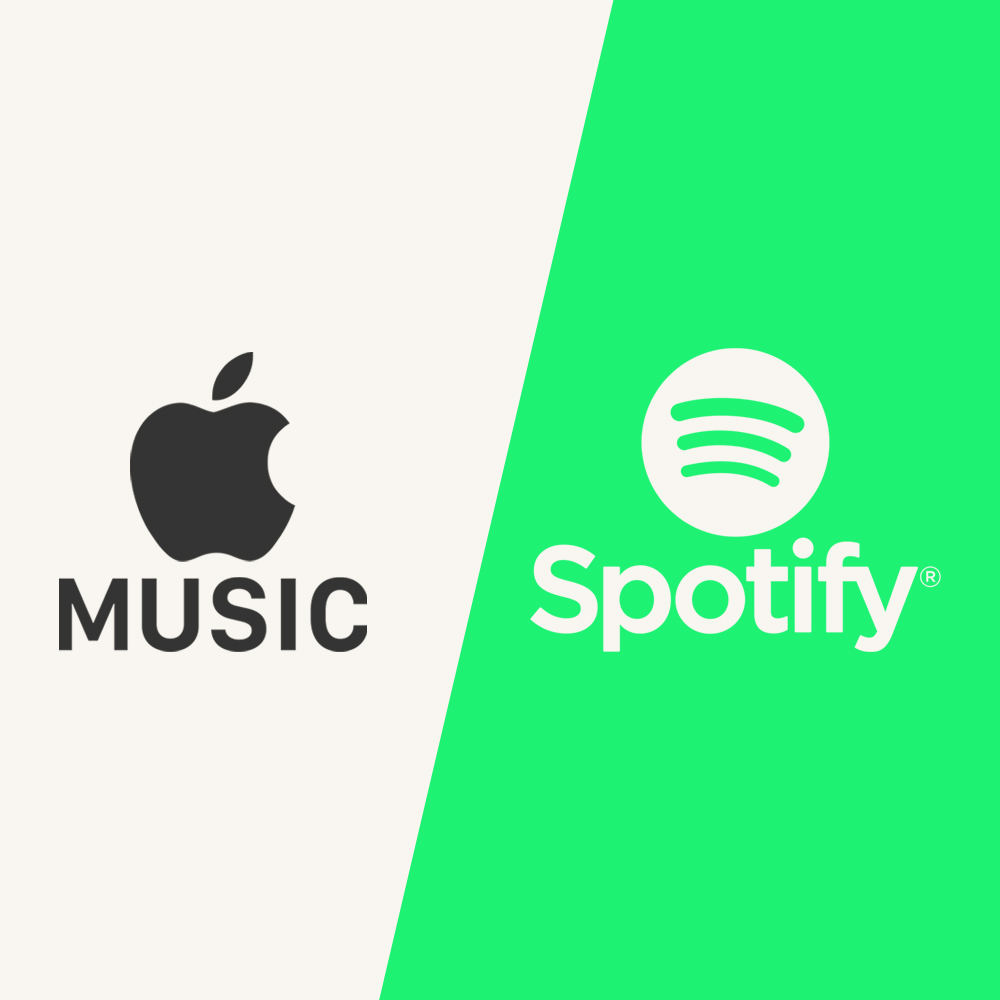
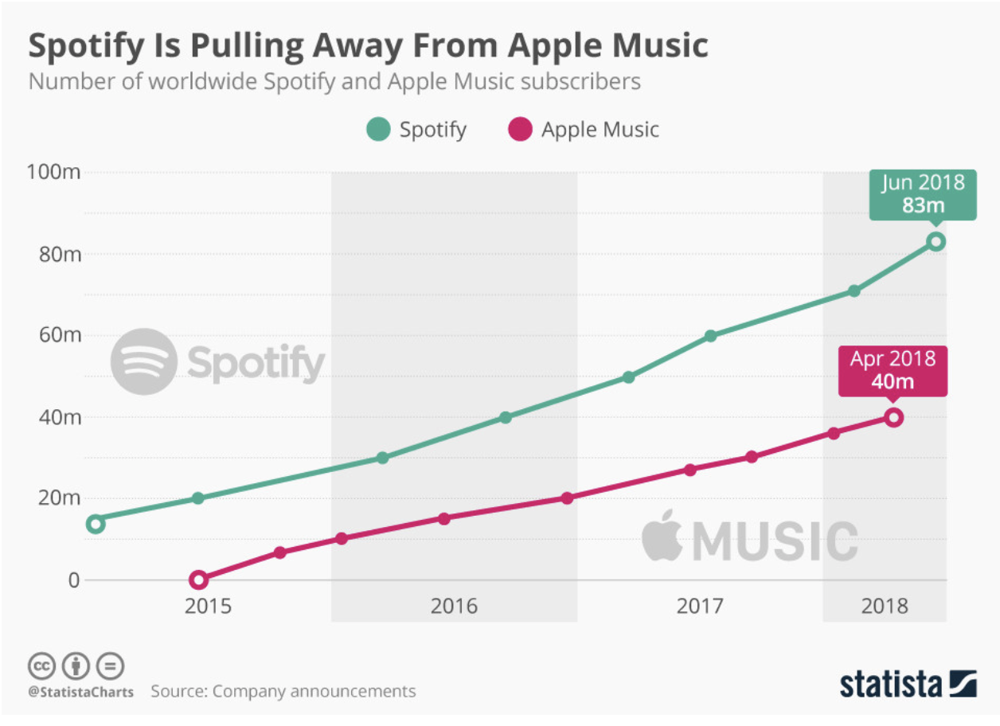
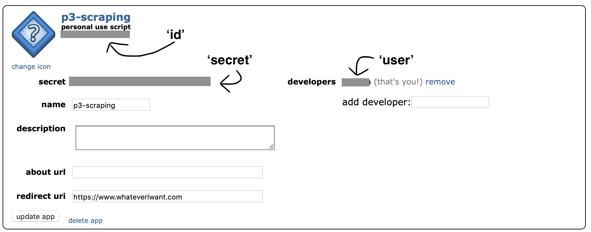
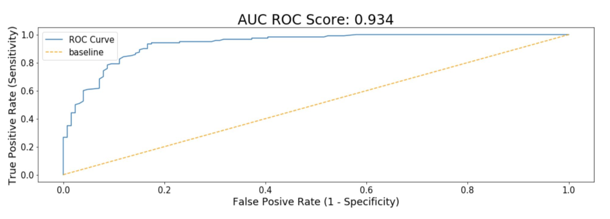
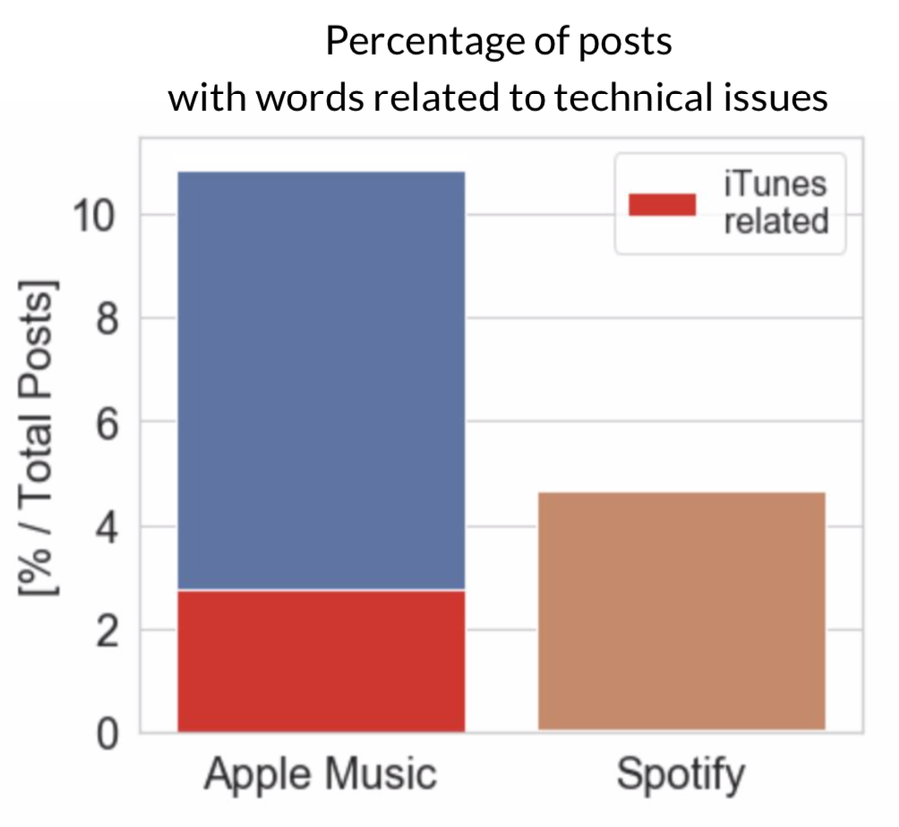
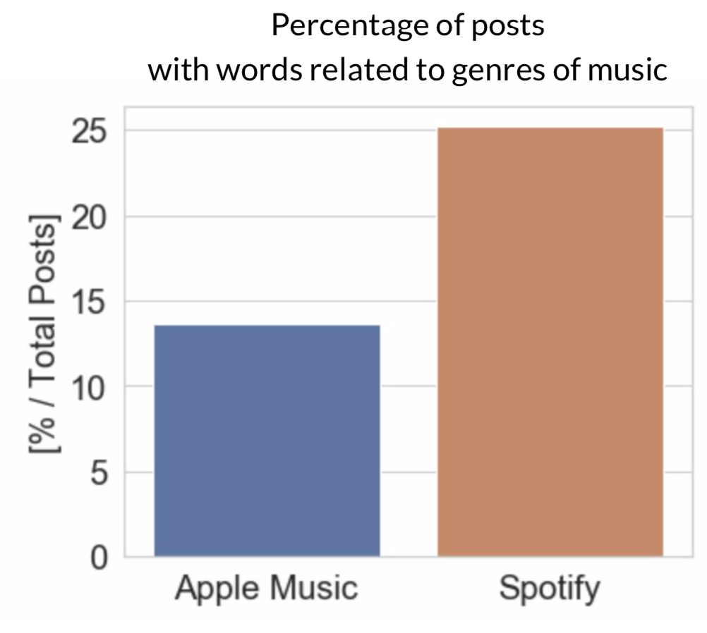
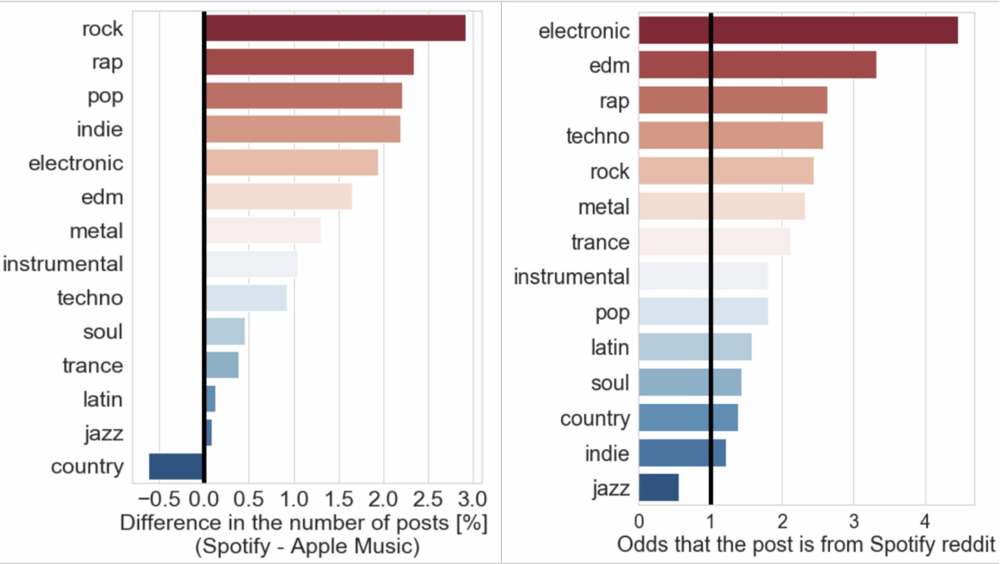

# Project 3: What do users want in Apple Music?


### Problem Statement
In this project, I use posts from subreddit for Apple Music and Spotify to build a classification model that predicts which subreddit each post are from in order to study what users want in Apple Music.



Spotify and Apple Music are similar music streaming services. Both services offer the same types of subscription, same price and similar size of song library. However, while Spotify has been rapidly growing in its number of active users and premium subscribers, the growth of Apple Music has been comparably stagnant. What do people want in their music streaming services that they get in Spotify but not in Apple Music?          

Source:                    
https://sidekick-music.com        
https://statista.com            
______

### How To Use This Repository
This project uses PRAW (Python Reddit API Wrapper) to scrap posts from Reddit. This requires login.

>First, create a JSON file and save the following dictionary for Reddit credentials.

```
reddit_creds = {'id': '',
                'secret': '',
                'user': '',
                'pass': ''}
```
>Next, fill in the dictionary with your credentials.



Log into your Reddit account here: https://www.reddit.com/prefs/apps to identify your 'id', 'secret' and 'user'. 'pass' is the password for your Reddit account.

> Use your Reddit credential JSON file to instantiate the reddit class from PRAW.

```
creds_file = open('your json file location', 'r')

reddit_creds = json.loads(creds_file.read())
```

Pass the direction to your reddit credential JSON file in the 'your json file location' section and run the code on Jupyter Notebook.

> Check if you are logged in.

```
reddit = praw.Reddit(
    client_id = reddit_creds['id'],
    client_secret = reddit_creds['secret'],
    username = reddit_creds['user'],
    password = reddit_creds['pass'],
    user_agent = '')

reddit.read_only
```

Replace '' in user_agent with your user_agent and run the code. If you see `False`, you are logged in and ready to scrap data from Reddit.

See `./code/01_web_scrapping.ipynb` in this repository to see my example.

Source: https://www.reddit.com
____________
### Executive Summary
1. **Reddit users talk about Apple Music and Spotify differently.**



Tf-Idf Vectorizer and Logistic Regression model were used for classification of the reddit posts. The AUC ROC score from the model was 0.934. Score of 1 being the perfect score, the high AUC ROC score indicates that the model is able to make predictions about both subreddits effectively.

|  | Score |
| ----------- | ----------- |
| Train | 0.9 |
| Test | 0.84 |
| Cross Validation | 0.84 |

The model resulted in the test score of 0.84, which indicates that the model is able to predict 84 percent of the new reddit posts to the correct subreddit.

The performance of the classification model shows that there is a difference between how reddit users talk about Apple Music and Spotify.

2. **Apple Music users talk about technical issues more than Spotify users.**



Apple Music users talk about technical issues 6 percent more than Spotify users on Reddit and quarter of the posts about technical issues mentioned iTunes.

3. **Spotify users talk about music more than Apple Music users.**



Music related conversations were 10 percent more frequent in Spotify subreddit.

4. **Spotify users and Apple Music users are interested in different genres of music.**



There was a difference in the genres of music the service users were attracted to. Spotify users made more posts about rock, rap, pop, indie and electronic music than Apple Music users. If the post mentioned electronic music, it was 4.8 times likely that the post was from Spotify subreddit.  
Apple Music users, on the other hand, made more posts about country music than Spotify users and if Jazz was mentioned in the post, it was more likely that the post was from Apple Music subreddit.

____________

### Conclusion & Recommendation

> Apple Music users need better support with technical issues, especially with iTunes.

Apply Music users need the support from other users to enjoy the streaming service. This could indicate that Apple Music needs an improvement in their customer support and identify areas where the service can be more user friendly.

> Current Apple Music users enjoy Jazz and Country. Spotify has more Electronic and rock music fans.

Apple Music can identify what about their service attracts jazz and country music fans and target the community to appeal that part of Apple Music. Also, Apple Music can examine what about Spotify attracts electronic, rap and pop music fans or what about Apple Music pushes them away.
____________

### Source
1. https://sidekick-music.com                   
2. https://www.reddit.com
3. https://statista.com
